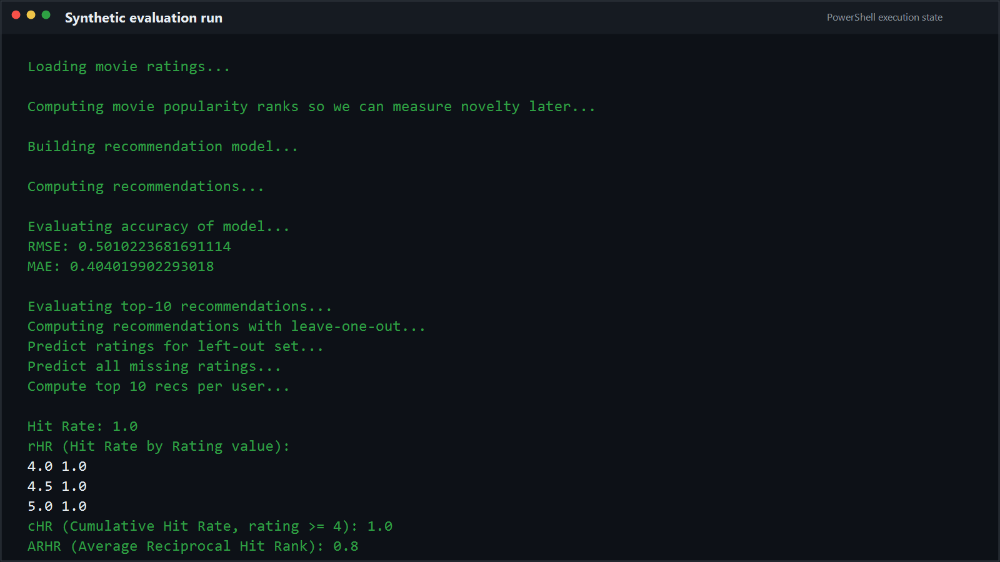
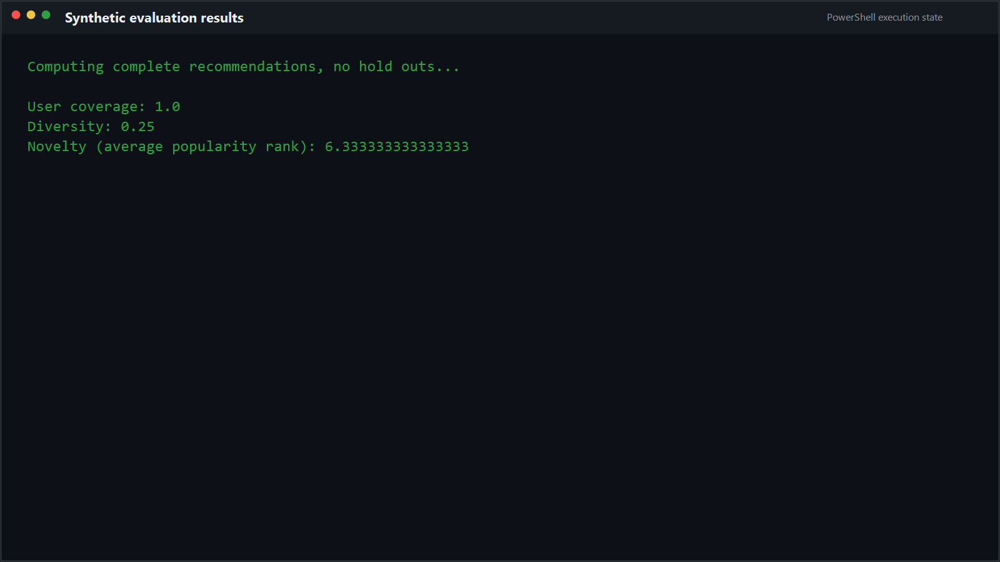
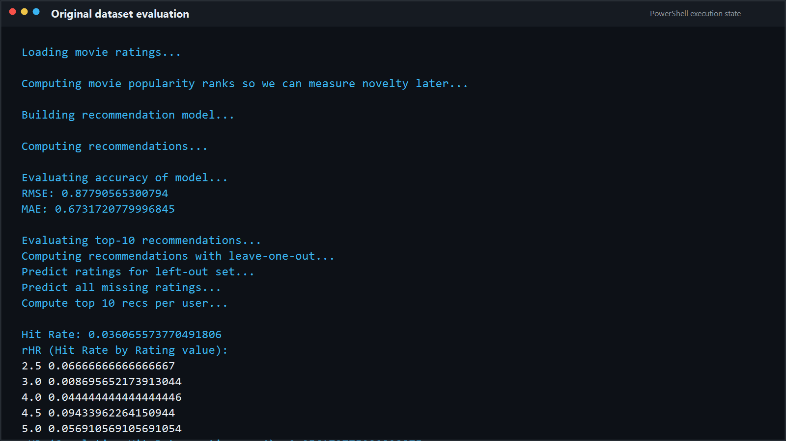
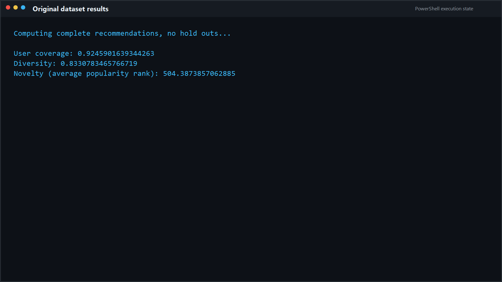

# Movie Recommender Evaluation

## Overview

This project evaluates a recommender system using the `surprise` library. It measures both prediction accuracy and recommendation quality so you can see how the model behaves beyond RMSE and MAE.

The repository now ships with a small synthetic MovieLens-style dataset so it runs immediately, even if you do not have the real MovieLens files yet.

## What It Measures

The evaluation script reports:

- RMSE and MAE for rating prediction quality
- Hit rate and cumulative hit rate for top-N recommendation quality
- ARHR for ranking quality
- User coverage for how many users receive recommendations above a threshold
- Diversity based on item similarity
- Novelty based on item popularity rank

## Project Layout

- `evaluate_model.py` - trains the recommender and prints the evaluation metrics
- `movie_lens_data.py` - loads either the bundled synthetic dataset or real MovieLens data
- `recommender_metrics.py` - ranking, accuracy, diversity, and novelty metrics
- `download_movielens_data.py` - optional helper to fetch the real MovieLens latest-small dataset
- `sample_data/ml-latest-small/` - bundled synthetic dataset used when real files are absent
- `requirements.txt` - runtime dependencies

## Version Control Notes

The repository is configured for GitHub with a root `.gitignore` that excludes local-only artifacts such as `.venv/`, `__pycache__/`, and a downloaded root-level `ml-latest-small/` dataset.

The bundled synthetic dataset in `sample_data/ml-latest-small/` is tracked in Git so the project stays runnable right after cloning.

## Quick Start

Use Python 3.11 or 3.10 for this project. Python 3.14 is not a good fit because `scikit-surprise` does not build cleanly there.

On Windows, create and activate a virtual environment, then install dependencies with the venv Python:

```powershell
py -3.11 -m venv .venv
.\.venv\Scripts\Activate.ps1
python -m pip install -r requirements.txt
```

If you do not want to activate the environment, run pip through the venv interpreter directly:

```powershell
.\.venv\Scripts\python.exe -m pip install -r requirements.txt
```

## Dataset Options

### Synthetic dataset, no downloads required

This is the default path now. If `ml-latest-small/ratings.csv` and `ml-latest-small/movies.csv` are not present in the project root, the loader automatically falls back to the bundled synthetic dataset in `sample_data/ml-latest-small/`.

Use this mode when you want to:

- run the project immediately after cloning
- experiment without downloading external data
- verify that the evaluation pipeline and metrics are working

### Real MovieLens data, optional

If you want the real MovieLens latest-small dataset instead, download it into the project root:

```powershell
python download_movielens_data.py
```

That creates a local `ml-latest-small/` folder containing the real `ratings.csv` and `movies.csv` files. If both the real dataset and the synthetic dataset exist, the real dataset is used first.

## Run

```powershell
python evaluate_model.py
```

If the real dataset is missing, the script will use the bundled synthetic data automatically.

## Synthetic Dataset Proof





## Original MovieLens Proof

The repository also works with the downloaded MovieLens latest-small dataset in the root `ml-latest-small/` folder.





## Synthetic Data Notes

The bundled dataset is intentionally small and is meant for:

- local development
- testing the evaluation flow
- demonstrating the project without external downloads

It is not a benchmark dataset and the scores will not match real MovieLens numbers. The goal is to keep the pipeline runnable and easy to understand.

## Troubleshooting

- If `pip install -r requirements.txt` tries to use Python 3.14, you are outside the virtual environment. Reactivate `.venv` or use `.\.venv\Scripts\python.exe -m pip install -r requirements.txt`.
- If you want the real data, make sure `ml-latest-small/ratings.csv` and `ml-latest-small/movies.csv` exist in the project root.
- If you only want to validate the code path, no extra setup is needed because the synthetic dataset is already bundled.
