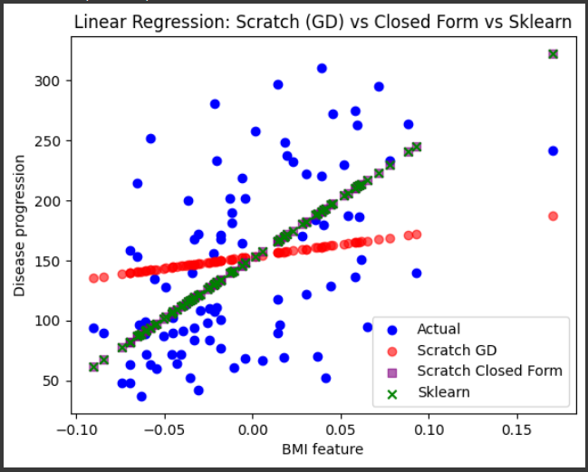

# Linear Regression from Scratch and Comparison with Sklearn

This project demonstrates the implementation of **Linear Regression**
from scratch in two ways: 1. Using **Gradient Descent (GD)**. 2. Using
the **Closed Form Solution (Normal Equation)**.

It also compares the performance with **Scikit-learn's
LinearRegression**.

------------------------------------------------------------------------

## 📊 Dataset

We use the **Diabetes dataset** from `sklearn.datasets`.\
For simplicity and visualization, only the **BMI feature** is used to
predict disease progression.

------------------------------------------------------------------------

## 🚀 Features of This Project

-   Implementation of **Linear Regression from scratch** with Gradient
    Descent.
-   Implementation of **Closed Form solution (Normal Equation)** from
    scratch.
-   **Comparison with Scikit-learn**'s Linear Regression model.
-   **Initial MSE baseline values** before training.
-   **Visualization** of predictions from all three models (Scratch GD,
    Closed Form, Sklearn).
-   Example of making predictions on a **new sample input**.

------------------------------------------------------------------------

## ⚙️ Project Workflow

1.  Load dataset and select one feature (BMI).
2.  Split data into training and test sets.
3.  Compute initial MSE baselines before training.
4.  Train:
    -   Scratch Gradient Descent model
    -   Scratch Closed Form model
    -   Scikit-learn Linear Regression model
5.  Compare final MSEs and visualize results.
6.  Make predictions on a new sample input.

------------------------------------------------------------------------

## 📈 Business Goals Achieved

-   Demonstrates **how linear regression works internally**
    (transparency in ML).
-   Shows the difference between **iterative optimization (GD)** and
    **analytical solution (Closed Form)**.
-   Provides a **foundation for predictive modeling**, useful for:
    -   Predicting health risks (e.g., disease progression based on
        BMI).
    -   Understanding the **impact of one feature** on an outcome
        variable.
-   Useful for **learning and teaching purposes** in ML fundamentals.

------------------------------------------------------------------------

## 🔧 Further Improvements (Scratch GD Model)

The Gradient Descent implementation can be improved in the following
ways: - **Learning Rate Scheduling**: Dynamically adjust learning rate
for faster and more stable convergence. - **Early Stopping**: Stop
training when loss stops improving to avoid unnecessary iterations. -
**Mini-Batch Gradient Descent**: Use batches instead of full dataset to
improve training efficiency. - **Feature Scaling**: Normalize features
to speed up convergence. - **Regularization (L1/L2)**: Add penalty terms
to reduce overfitting when multiple features are used.

------------------------------------------------------------------------

## 📊 Results

- Initial MSE (Scratch GD): 26548.584269662922
- Initial MSE (Closed Form baseline): 5361.533457238513
- Initial MSE (Sklearn baseline): 5361.533457238513
- Final MSE (Scratch GD): 4716.855348115728
- Final MSE (Closed Form): 4061.8259284949268
- Final MSE (Sklearn): 4061.8259284949268

(*Exact values depend on random train/test split*)

------------------------------------------------------------------------

## 🖼️ Visualization



------------------------------------------------------------------------

## 📦 How to Run

1.  Clone this repository.
2.  Install requirements (numpy, matplotlib, scikit-learn).
3.  Run the Python script.

``` bash
pip install -r requirements.txt
python linear_regression_scratch.py
```

------------------------------------------------------------------------

## 🎯 Conclusion

This project bridges **theory and practice** by showing both: - **How
linear regression works under the hood** (scratch GD + Closed Form). -
**How modern libraries solve the same problem efficiently**.

It serves as a **learning project for ML fundamentals** and provides
insights into model training, evaluation, and prediction.
